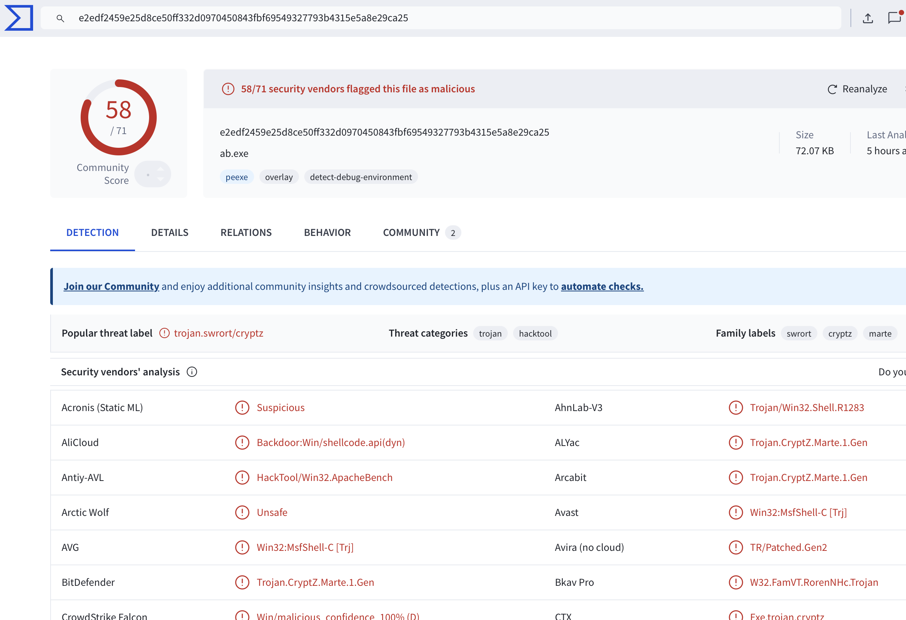
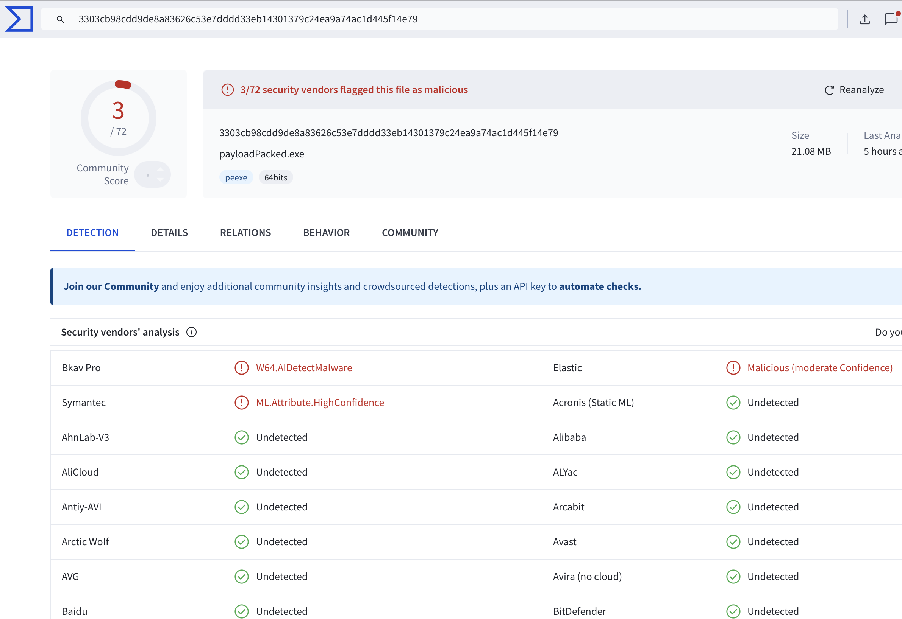

# 🔐 ROPacker

**ROPacker** is a custom **Windows PE file packer** designed to obfuscate executables using both **static and dynamic** techniques to evade analysis and detection. It consists of:

- 🧰 `packer.exe`: Handles **compression** and **encryption**
- 🕵️ `stub.exe`: Executes payload while avoiding dynamic analysis

> 🧪 Built and tested on **Windows 10 64-bit**

---

## ✨ Features

🔒 **Encryption & Compression**
- 📦 Compresses executables with the **Deflate** algorithm
- 🔐 Encrypts payloads using the **XTEA** algorithm

🛡️ **Evasion Techniques**
- 🧠 Detects debugging and virtual environments
- 🪝 Implements **Process Hollowing**
- 🧩 Uses **Return-Oriented Programming (ROP)** for anti-analysis

⚙️ **Obfuscation Modes**
- 🔁 **Default (Static + Dynamic)**: Highest stealth level
- 🧊 **Static Only** (`-ndo` flag): Better compatibility, higher detection risk

---

## 🚀 Usage

```bash
packer.exe <inputFile.exe> <outputFile.exe> [args]
```

### 🧩 Arguments

- `-ndo` — ❌ **No Dynamic Obfuscation**: disables ROP and process hollowing

---

## 🛠️ Compilation

### 🔧 Build `packer.exe`

```bash
g++ packer.cpp -o packer.exe -limagehlp -lz
```

### 🔧 Build `stub.exe`

> 📁 Replace `"yourPathToCapstone"` with the correct path to your **Capstone 6.0.0-Alpha4** installation

```bash
g++ -s -O2 -ffunction-sections -fdata-sections "-Wl,--gc-sections" -o stub.exe stub.cpp -lz \
-I "yourPathToCapstone/capstone-6.0.0-Alpha4/include" \
-L "yourPathToCapstone/capstone-6.0.0-Alpha4/build" -lcapstone
```

---

## 📊 Results

ROPacker works well with relatively simple **console applications** and has been tested with **payloads**, which preserve their original functionality.

🔍 **Detection rate drops significantly** when using a customized packer.

### 🧪 VirusTotal Comparison

| Before Obfuscation | After Obfuscation |
|--------------------|-------------------|
|  |  |

---

## ⚠️ Disclaimer

> This tool is intended for **educational** and **research purposes only**.  
> **Do not** use it for malicious activities — such use is unethical and may be **illegal** in your jurisdiction.
